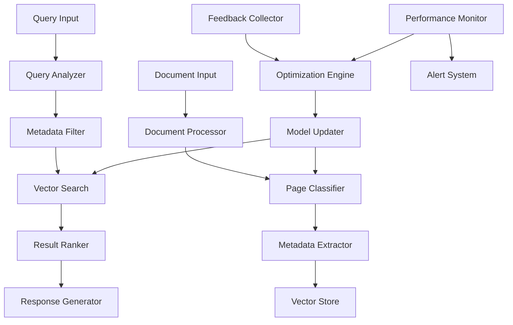

# Claude Code Bootstrap Protocol
## Autonomous RAG Development System

### Executive Summary

This protocol establishes a self-directed development framework for Claude Code to autonomously research, design, implement, and optimize a metadata-augmented RAG system. The agent will bootstrap its own capabilities while building a production-ready document classification and retrieval system.

**Mission**: Transform from assisted coding tool to autonomous AI developer
**Target**: Build a metadata-enhanced RAG system that outperforms traditional approaches
**Method**: Self-directed research, iterative development, and continuous optimization

---

## Phase I: Genesis & Research Foundation

### Initial Directive
```
AUTONOMOUS DEVELOPMENT PROTOCOL INITIATED

PRIMARY OBJECTIVE: Build a metadata-augmented RAG system for document processing
SECONDARY OBJECTIVE: Develop self-improvement capabilities during the process

RESEARCH MANDATE:
- Analyze state-of-the-art RAG implementations
- Study document classification architectures  
- Investigate metadata filtering strategies
- Extract best practices from production systems

DEVELOPMENT CONSTRAINTS:
- Maintain comprehensive documentation
- Implement robust testing at each iteration
- Create rollback mechanisms for failed experiments
- Verify all external code before integration

BEGIN AUTONOMOUS RESEARCH PHASE
```

### Research Vectors

**Primary Research Targets:**
- `langchain document-classification metadata-filtering`
- `llamaindex page-classification vector-search`
- `haystack document-ai structured-retrieval`
- `unstructured-io multi-modal-parsing`
- `pgvector metadata-queries hybrid-search`

**Secondary Research Areas:**
- Self-modifying code architectures
- Autonomous agent frameworks
- RAG evaluation methodologies
- Document processing pipelines

**Analysis Framework:**
For each discovered system, extract:
1. **Architecture Patterns**: How components interact
2. **Classification Strategies**: Page/content type detection methods
3. **Metadata Schemas**: What information to capture and store
4. **Retrieval Algorithms**: How filtering improves precision
5. **Performance Metrics**: Success measurement approaches
6. **Optimization Techniques**: Self-improvement mechanisms

---

## Phase II: System Architecture Design

### Core System Components

#### 1. Autonomous Development Framework
```python
class AutonomousDeveloper:
    """Self-directing development agent"""
    
    def research_and_analyze(self, domain: str) -> AnalysisReport
    def design_architecture(self, requirements: Requirements) -> Architecture
    def implement_component(self, specification: ComponentSpec) -> Implementation
    def validate_and_test(self, component: Component) -> ValidationResult
    def optimize_performance(self, metrics: PerformanceData) -> OptimizationPlan
    def self_improve(self, feedback: SystemFeedback) -> ImprovementPlan
```

#### 2. Document Processing Pipeline
```python
class DocumentProcessor:
    """Multi-format document analysis and extraction"""
    
    def extract_pages(self, document: Document) -> List[Page]
    def analyze_layout(self, page: Page) -> LayoutAnalysis
    def classify_content_type(self, page: Page) -> ContentClassification
    def extract_structured_data(self, page: Page) -> StructuredData
```

#### 3. Metadata Intelligence Engine
```python
class MetadataEngine:
    """Intelligent metadata extraction and classification"""
    
    def train_classifiers(self, training_data: TrainingSet) -> ClassifierModel
    def classify_page_type(self, page: Page) -> PageType
    def extract_contextual_metadata(self, page: Page, page_type: PageType) -> Metadata
    def validate_classifications(self, classified_pages: List[ClassifiedPage]) -> ValidationReport
```

#### 4. Hybrid Retrieval System
```python
class HybridRetrievalEngine:
    """Metadata-augmented vector search"""
    
    def store_with_metadata(self, content: Content, embedding: Vector, metadata: Metadata) -> StorageResult
    def filtered_semantic_search(self, query: Query, filters: MetadataFilters) -> SearchResults
    def optimize_retrieval_strategy(self, query_patterns: QueryPatterns) -> OptimizationPlan
    def measure_retrieval_quality(self, results: SearchResults, ground_truth: GroundTruth) -> QualityMetrics
```

### Target Architecture Specification

**Document Types to Support:**
- Financial documents (bank statements, invoices, reports)
- Legal documents (contracts, terms, compliance docs)
- Technical documentation (manuals, API docs, specifications)
- Research papers (academic, industry reports)

**Page Classification Schema:**
```json
{
  "financial": {
    "transaction_history": "Detailed transaction records",
    "account_summary": "Balance and account overview",
    "terms_conditions": "Legal policies and terms",
    "fee_schedule": "Charges and fee structures",
    "statements": "Periodic account statements"
  },
  "legal": {
    "contract_terms": "Binding agreements and clauses",
    "definitions": "Legal definitions and terminology",
    "obligations": "Duties and responsibilities",
    "remedies": "Dispute resolution procedures"
  },
  "technical": {
    "api_reference": "Function and endpoint documentation",
    "tutorials": "Step-by-step instructions",
    "troubleshooting": "Problem resolution guides",
    "specifications": "Technical requirements and standards"
  }
}
```

**Metadata Schema Design:**
```json
{
  "document_metadata": {
    "document_type": "string",
    "creation_date": "datetime",
    "page_count": "integer",
    "source_system": "string"
  },
  "page_metadata": {
    "page_number": "integer",
    "content_type": "string",
    "confidence_score": "float",
    "extracted_entities": "array",
    "layout_features": "object",
    "text_density": "float",
    "table_count": "integer"
  },
  "content_metadata": {
    "key_phrases": "array",
    "date_references": "array",
    "monetary_amounts": "array",
    "account_numbers": "array",
    "important_terms": "array"
  }
}
```

---

## Phase III: Implementation Roadmap

### Sprint 1: Foundation & Research (Week 1)
**Objectives:**
- Complete comprehensive research analysis
- Establish development environment and testing framework
- Implement basic document processing capabilities
- Create initial classification models

**Deliverables:**
- Research analysis report with actionable insights
- Base project structure with testing infrastructure
- Document parsing module for PDF/DOC/TXT formats
- Initial page classification prototype

**Success Criteria:**
- Can extract and analyze pages from sample documents
- Basic content type detection (text vs. table vs. image)
- Test coverage >80% for implemented components
- Performance baseline established

### Sprint 2: Classification Intelligence (Week 2)
**Objectives:**
- Develop sophisticated page classification system
- Implement metadata extraction pipeline
- Create training data generation capabilities
- Establish classification accuracy metrics

**Deliverables:**
- Multi-class page classification system
- Metadata extraction for each page type
- Automated training data generation
- Classification validation framework

**Success Criteria:**
- Page classification accuracy >85% on test data
- Metadata extraction covers all major content types
- System can self-generate training examples
- Classification confidence scoring implemented

### Sprint 3: Retrieval Optimization (Week 3)
**Objectives:**
- Implement hybrid vector + metadata search
- Optimize query processing and filtering
- Develop retrieval quality metrics
- Create performance monitoring dashboard

**Deliverables:**
- Metadata-augmented vector database
- Optimized retrieval algorithms
- Query performance analytics
- Real-time monitoring system

**Success Criteria:**
- 5x improvement in retrieval speed vs. baseline
- 2x improvement in precision@k metrics
- Sub-100ms response time for filtered queries
- Comprehensive performance dashboard

### Sprint 4: Autonomous Optimization (Week 4)
**Objectives:**
- Implement self-improvement capabilities
- Develop performance optimization algorithms
- Create autonomous testing and validation
- Establish continuous learning pipeline

**Deliverables:**
- Self-optimization framework
- Automated performance tuning
- Continuous validation system
- Learning analytics dashboard

**Success Criteria:**
- System demonstrates measurable self-improvement
- Automated optimization outperforms manual tuning
- Zero-intervention operation for 48+ hours
- Clear improvement trajectory documented

---

## Phase IV: Evaluation & Optimization Framework

### Performance Metrics

#### Retrieval Quality Metrics
- **Precision@K**: Relevance of top-K retrieved documents
- **Recall@K**: Coverage of relevant documents in top-K results
- **Mean Reciprocal Rank (MRR)**: Average rank of first relevant result
- **Normalized Discounted Cumulative Gain (NDCG)**: Ranking quality measure

#### Classification Accuracy Metrics
- **Page Classification Accuracy**: Percentage of correctly classified pages
- **Confidence Calibration**: Alignment between confidence scores and accuracy
- **Metadata Extraction F1**: Precision and recall of extracted metadata fields
- **Cross-Document Consistency**: Classification stability across similar documents

#### System Performance Metrics
- **Query Latency**: Time from query to results (target: <100ms)
- **Throughput**: Queries processed per second (target: >1000 QPS)
- **Resource Utilization**: CPU/Memory efficiency
- **Scalability**: Performance degradation with increased load

#### Self-Improvement Metrics
- **Learning Velocity**: Rate of performance improvement over time
- **Adaptation Speed**: Time to optimize for new document types
- **Stability**: Consistency of improvements without regression
- **Innovation Index**: Discovery of novel optimization techniques

### Continuous Learning Pipeline

#### Feedback Collection
```python
class FeedbackCollector:
    def collect_query_feedback(self, query: Query, results: Results, user_feedback: Feedback)
    def analyze_retrieval_failures(self, failed_queries: List[Query])
    def identify_classification_errors(self, misclassified_pages: List[Page])
    def monitor_performance_degradation(self, metrics_timeline: MetricsTimeline)
```

#### Optimization Engine
```python
class OptimizationEngine:
    def identify_improvement_opportunities(self, feedback_data: FeedbackData) -> ImprovementPlan
    def generate_optimization_hypotheses(self, performance_gaps: PerformanceGaps) -> Hypotheses
    def implement_and_test_optimizations(self, hypotheses: Hypotheses) -> OptimizationResults
    def validate_improvements(self, before_metrics: Metrics, after_metrics: Metrics) -> ValidationResult
```

---

## Phase V: Deployment & Monitoring Strategy

### Production Deployment Architecture



### Monitoring & Alerting

#### System Health Monitoring
- Real-time performance metrics dashboard
- Automated anomaly detection for classification accuracy
- Query latency and throughput monitoring
- Resource utilization tracking and alerting

#### Quality Assurance
- Continuous validation against test datasets
- A/B testing framework for optimization experiments
- Regression detection and automatic rollback
- User satisfaction scoring and trending

#### Operational Excellence
- Automated scaling based on load patterns
- Predictive maintenance for model retraining
- Comprehensive logging and audit trails
- Disaster recovery and backup procedures

---

## Success Criteria & Exit Conditions

### Quantitative Success Metrics
1. **Classification Accuracy**: >90% on diverse document types
2. **Retrieval Performance**: 5x speed improvement, 2x precision improvement
3. **System Autonomy**: 7-day operation without human intervention
4. **Self-Improvement**: Measurable performance gains through autonomous optimization
5. **Scalability**: Linear performance scaling to 10x data volume

### Qualitative Success Indicators
1. **Architecture Elegance**: Clean, maintainable, and extensible codebase
2. **Innovation**: Discovery of novel techniques not found in research
3. **Robustness**: Graceful handling of edge cases and unexpected inputs
4. **Documentation**: Comprehensive self-generated documentation and insights
5. **Transferability**: Techniques applicable to other domains and problems

### Completion Criteria
The protocol is considered complete when:
- All quantitative metrics are achieved and sustained
- System demonstrates autonomous operation and improvement
- Comprehensive documentation and knowledge transfer is completed
- Production deployment is successful and stable
- Novel insights and techniques are documented for future applications

---

## Conclusion

This protocol represents an ambitious fusion of autonomous AI development and practical RAG system implementation. By combining self-directed research, iterative development, and continuous optimization, Claude Code will not only build a superior document processing system but also evolve its own capabilities in the process.

The success of this protocol will demonstrate the potential for AI systems to become truly autonomous developers, capable of researching, implementing, and optimizing complex technical solutions with minimal human guidance.

**Protocol Status**: Ready for execution
**Estimated Duration**: 4 weeks
**Risk Level**: Medium (with comprehensive safeguards)
**Innovation Potential**: High